<div align="center">


### PTBS — Personal Tetra Base Station

Estación base TETRA para Raspberry Pi. Se instala sola y se maneja desde el navegador.

</div>

Mantenido por **Aitor, EA4HBL**.

Hardware con el que se ha usado: LimeSDR Mini 2.0, SXceiver, Motorola MXP600, MTM800E y MTM5400.

Esta guía recorre el programa como lo ve quien lo va a usar: instalación, primer arranque, asistente, perfiles, ajustes del panel, despacho, copias y actualización. El idioma del panel puede ser español o inglés; aquí se usan los nombres en español.

---

## Qué es

PTBS pone en el aire una celda TETRA (TMO) desde una Raspberry Pi y un SDR. Las radios se registran en esa celda. Desde el panel puedes ver quién está en línea, cambiar de red, mandar mensajes SDS, asignar grupos y, con el despacho, hablar desde el navegador.

Hay dos modos de red habituales:

- **Celda local.** Las radios se hablan entre ellas en tu estación. El perfil Brew se deja en **Offline (sin Brew)**.
- **Enlazada a un core.** La celda se conecta a un servidor Brew (por ejemplo una red compartida). Eliges un perfil **Core Net (Brew)**.
- **Despacho.** La consola del navegador actúa como un operador. Hace falta el perfil Brew **Despacho LST**.

La radio puede estar apagada y el panel sigue respondiendo. Así se configura el equipo antes de salir al aire.

---

## Qué necesitas

- Raspberry Pi con **Raspberry Pi OS / Debian arm64**.
- Un SDR soportado por SoapySDR. Los controladores de **SXceiver** y **Lime** se instalan desde el asistente, no a mano.
- Las radios programadas con el mismo MCC, MNC, colour code y el par de frecuencias de la celda.
- Un navegador en el mismo equipo o en la red local. El micrófono del despacho exige **HTTPS**.

La Pi no necesita Rust ni un compilador. El instalador baja el paquete ya compilado. La voz va dentro.

---

## Instalación automática

Abre una terminal en la Pi (o por SSH) y pega **una** de estas órdenes.

Canal estable:

```bash
curl -fsSL https://raw.githubusercontent.com/Aitorrio/ptbs-dist/main/contrib/install/install-ptbs.sh | sudo bash
```

Canal beta:

```bash
curl -fsSL https://raw.githubusercontent.com/Aitorrio/ptbs-dist/beta/contrib/install/install-ptbs.sh | sudo env PTBS_BRANCH=beta bash
```

El estable sigue el release `latest-stable`. El beta sigue `latest-beta`. En una Pi nueva, el estable es el punto de partida.

El script hace esto, en orden:

1. Instala `curl` si falta. No instala Rust ni SoapySDR.
2. Descarga `ptbs_arm64.deb` y `ptbs.sha256` del release del canal y comprueba la suma.
3. Instala el paquete. Dentro van el programa, el codec de voz, el servicio, el helper del asistente y, en el primer arranque, la configuración.
4. La radio queda apagada (`phy_io.backend = "None"`) para que el panel abra aunque todavía no haya SDR.
5. El panel queda en `admin` / `1234`, HTTP 80 y HTTPS 443.
6. Activa y arranca `ptbs`.

Al terminar, la terminal imprime la dirección del panel.


| | |
|---|---|
| Panel | `https://<ip-de-la-pi>/` |
| Usuario inicial | `admin` |
| Contraseña inicial | `1234` |
| Configuración | `/etc/ptbs/config.toml` |
| Reserva | `/etc/ptbs/config.toml.fallback` |

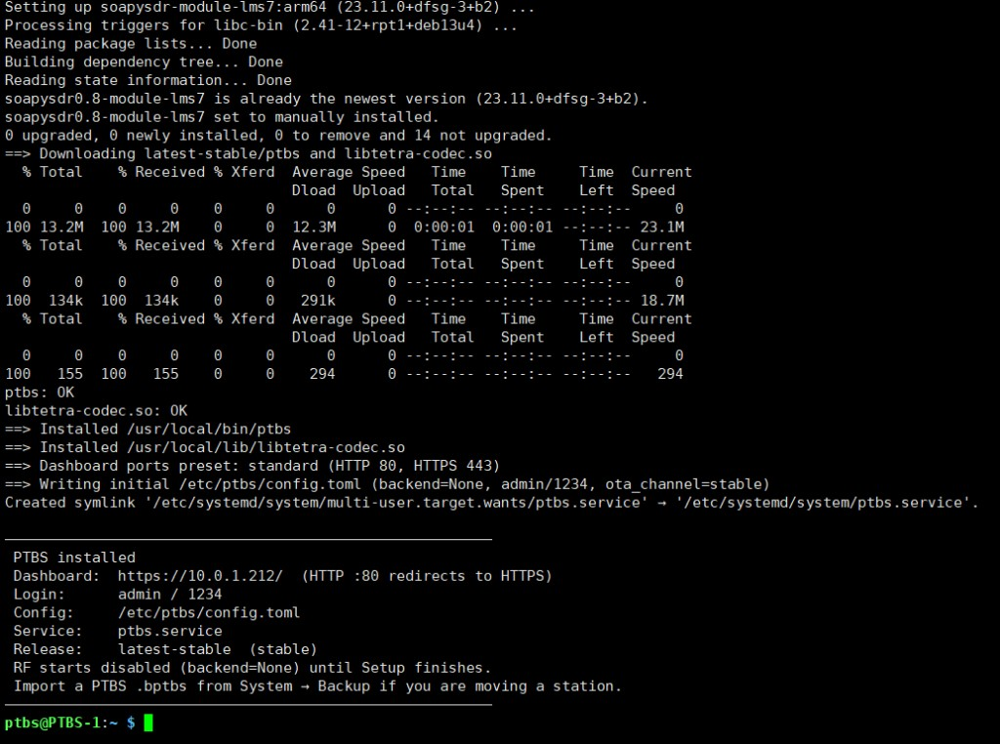

Si vuelves a lanzar el mismo instalador, **no pisa** la configuración ni la reserva. Sustituye el programa y el codec que van dentro del paquete.

Una estación antigua no se convierte sola en PTBS. Exporta antes una copia `.bptbs` (más abajo), instala PTBS limpio e impórtala.

Variables poco habituales (`PTBS_DASH_PORTS`, `PTBS_SKIP_TETRA_CODEC`, …) están en [`Docs/install-and-setup.md`](Docs/install-and-setup.md).

---

## Primer acceso

1. Abre la URL que imprimió el instalador.
2. El certificado es de la propia estación. El navegador avisa la primera vez: acéptalo y entra. Sin esa excepción, el despacho no puede usar el micrófono.
3. Entra con `admin` / `1234`.
4. Arriba a la derecha están el **tema** (oscuro o claro) y el **idioma** (español o inglés). Sirven igual en el móvil.
5. Cambia usuario y contraseña en cuanto puedas: **Sistema → Acceso al panel**.

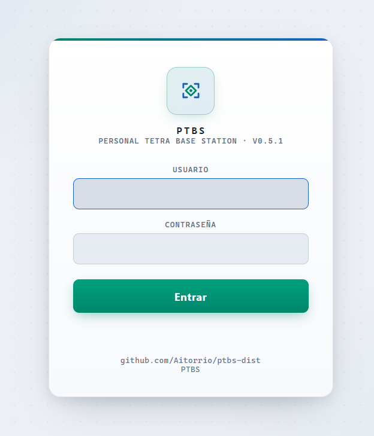

Si el alta no está hecha, se abre el asistente. También puedes abrirlo luego en **Setup → Abrir asistente**.

---

## Cómo está organizado el panel

La barra de la izquierda tiene tres bloques.

**Monitor.** Lo que está pasando ahora.

| Página | Para qué sirve |
|---|---|
| **Inicio** | Radios registrados, llamadas, identidad de la celda y cambio rápido de perfil |
| **DGNA** | Asignar o quitar un grupo de conversación a una radio, por el aire |
| **Llamadas** | Llamadas activas |
| **Última actividad** | Lo último que se ha oído |
| **RF** | Espectro, constelación y temperatura del SDR |
| **Salud** | Si los subsistemas están bien |
| **Log** | Registro en vivo, para diagnosticar |
| **Registro SDS** | Mensajes de texto, estados y posiciones |

**Integraciones.** Servicios de alrededor. **Despacho LST** es la consola de voz. Telegram, DAPNET y GeoAlarm aparecen para alertas, radiobúsqueda y posiciones. Una entrada solo es útil cuando ese servicio está configurado.

**Sistema.** Donde se configura la estación: **Red** (si hay NetworkManager), **Setup**, **Config** y **Sistema**.

Abajo del todo, dos pilotos: **BS** (la celda) y **BREW** (el enlace al core, si lo hay). Un aviso en la barra indica que el canal de actualización tiene una versión nueva.

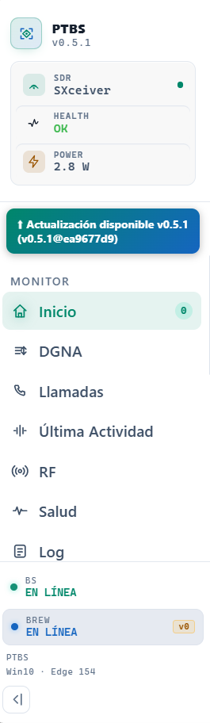

En el móvil la barra se abre con el menú. Los botones de tema, idioma y alimentación (reiniciar, suspender, apagar) están en la barra superior.

---

## Asistente de alta

El asistente termina lo que el paquete no trae: el software de la radio, el driver y el encendido. No se puede cerrar ni omitir. Hasta **Finalizar**, la estación no transmite.

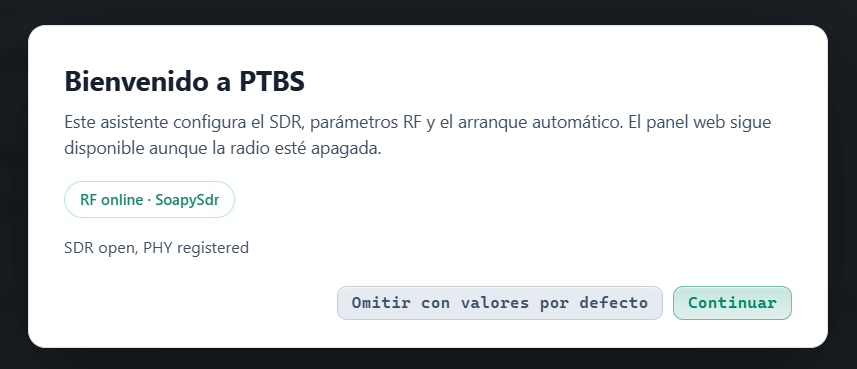

### 1. Bienvenida

Explica que este paso cierra la instalación. **Continuar**.

### 2. Internet

Muestra el enlace que ya estás usando (tú y la Pi) y comprueba si la Pi llega a la red de paquetes y a GitHub. Sin esa salida no se puede seguir.

### 3. Software de la radio

Instala SoapySDR, que no va dentro del paquete. Hay una barra de progreso.

### 4. Seleccionar SDR

Si Soapy ve una sola radio, queda elegida. Si ve varias, eliges. Si no ve ninguna (un HAT SXceiver a menudo no aparece hasta tener el driver), eliges SXceiver o Lime.

### 5. Driver

Instala el controlador de esa radio. SXceiver se compila en la Pi; la barra lo va contando.

### 6. Valores de fábrica

La celda, la red y Brew se quedan como en el ejemplo. La radio sigue apagada. Eso se cambia después en Config.

### 7. Arranque automático

El servicio queda activado para volver tras un reinicio.

### 8. Finalizar

Enciende la radio, guarda el SDR elegido y reinicia. Después el navegador vuelve solo; si pide la contraseña, entra otra vez. Ahí se cierra el asistente.

Si más adelante cambias de SDR, vuelve a **Setup**. El identificador del dispositivo se fija ahí. En Config se ve, pero no es el sitio para cambiar de equipo.

---

## Inicio

**Inicio** es la vista de operación.

Arriba, **Perfiles rápidos**: un desplegable **TMO Cell**, otro **Core Net (Brew)** y el botón **Aplicar y reiniciar**. Cambia la pareja que está al aire sin abrir Config. **Más ajustes** lleva a la ficha completa.

Debajo, el recuento de radios registradas, las llamadas activas y el estado Brew. La tarjeta de la celda muestra TX, RX, dúplex, MCC, MNC, portadora y las ranuras de tiempo.

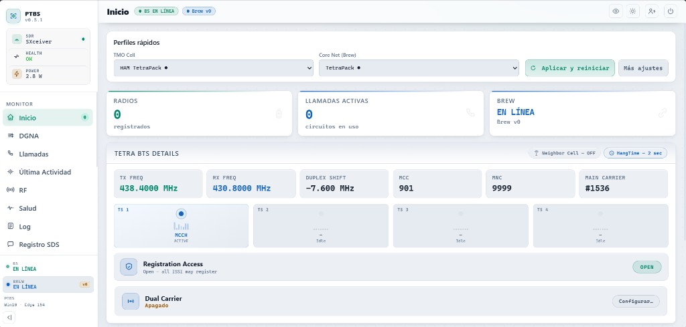

La tabla **Radios registrados** lista cada ISSI (y el indicativo, si se conoce), grupos, ahorro de energía, señal y antigüedad. Desde la fila puedes **expulsar** un terminal o enviarle un **SDS**.

Un banner rojo de **emergencia** aparece cuando una radio la declara. Se puede borrar desde ahí.

---

## Perfiles

Un perfil es una configuración con nombre, para no reescribir la estación cada vez que cambias de uso.

Hay dos familias, y se aplican **en pareja**:

| Familia | Qué guarda |
|---|---|
| **TMO Cell** | La celda: frecuencias, colour code, MCC/MNC, área, temporizadores, celdas vecinas aisladas y la lista blanca de esa celda |
| **Core Net (Brew)** | A dónde se enlaza: sin red, un servidor Brew, o el despacho |

**Offline (sin Brew)** y **Despacho LST** vienen de serie y no se pueden borrar.

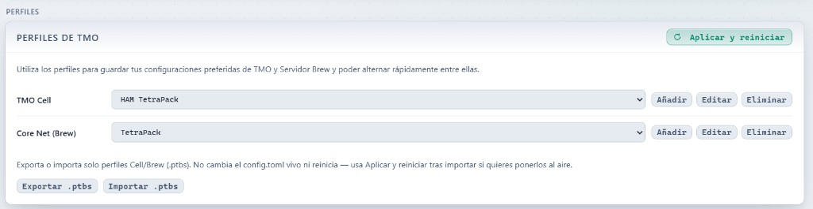

### Crear o editar

1. Abre **Config**. La primera sección es **Perfiles de TMO**.
2. Elige la celda y la red, o pulsa **Añadir**.
3. **Editar** abre la ficha. El título dice si estás en **Añadir TMO Cell**, **Editar TMO Cell**, **Añadir Core Net (Brew)** o **Editar Core Net (Brew)**.
4. Ponle un nombre reconocible («Casa 430», «BrandMeister», «Solo despacho»…).
5. **Guardar** / **Actualizar** escribe el perfil. **No reinicia** y no cambia lo que está al aire.
6. **Guardar como** duplica la ficha con otro nombre.
7. Cuando la pareja sea la que quieres emitir, **Aplicar y reiniciar**. La estación hace una copia del `config.toml` actual, carga esa pareja y reinicia. Las llamadas en curso se cortan un momento.

La misma pareja se puede aplicar desde **Inicio → Perfiles rápidos**.

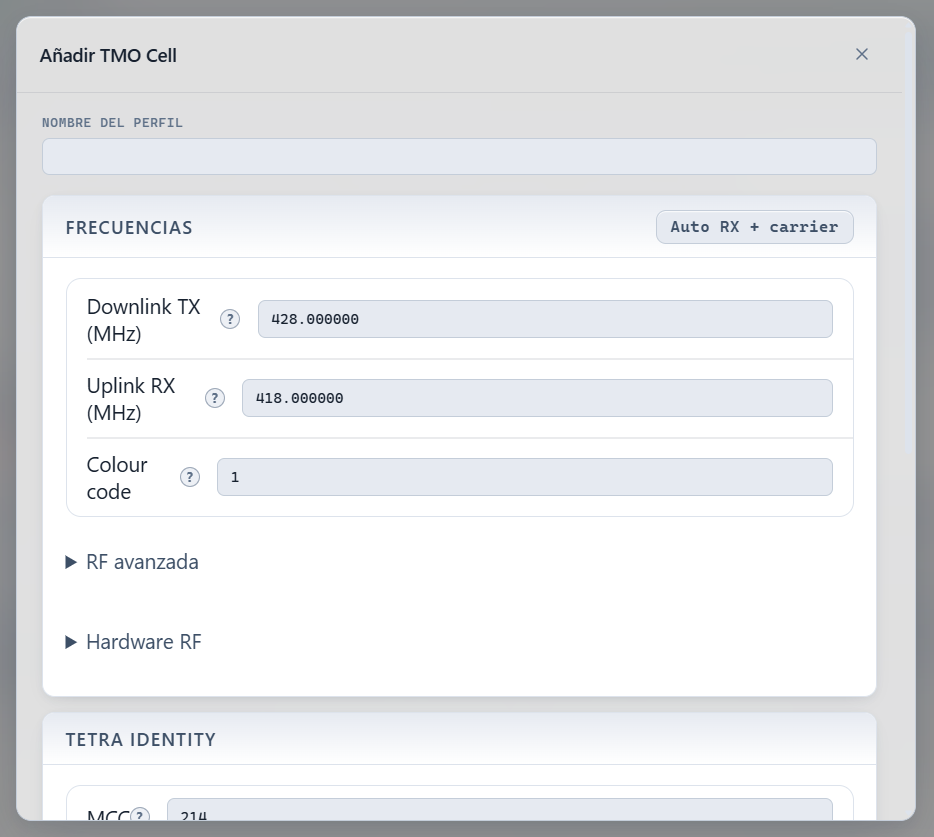

### Qué va en la celda

En la ficha de la celda están las frecuencias en **MHz** (coma o punto; al salir del campo quedan con seis decimales, como en el CPS de Motorola). En el fichero se guardan en Hz. **Auto RX + carrier** calcula la subida y la portadora a partir de la bajada cuando el dúplex es el habitual.

Colour code (0–63), MCC, MNC y área de localización tienen que ser los de tus radios. La zona horaria (por ejemplo `Europe/Madrid`) solo afecta al reloj que muestra la estación.

**RF avanzada** y **Hardware RF** están cerrados. Ahí viven el dúplex personalizado, el offset fino, el PPM del SDR y las ganancias. El dispositivo SDR es de solo lectura: se cambia en Setup. Una ganancia que no pertenece a tu controlador (un control de Lime en un SXceiver, por ejemplo) se rechaza al guardar. Un campo vacío significa «el valor por defecto del equipo».

### Celdas vecinas aisladas

Está en **Identidad TETRA**, en la ficha del perfil **TMO Cell** y en **Config → Ajustes en vivo**. Es la misma lista.

Cada estación anuncia hasta siete celdas vecinas. El móvil ve esas portadoras y, con el área de localización distinta, puede registrarse en la otra por su cuenta. Cada vecina es otra estación, con su propio Brew. No hay una gestión central entre las dos: la llamada que el móvil trae puesta se corta.

Las dos estaciones se apuntan la una a la otra, con el mismo MCC y MNC. En el perfil, **Guardar** deja la lista en la ficha y sale al aire con **Aplicar y reiniciar**. En ajustes en vivo, **Aplicar y reiniciar** escribe la config que está corriendo.

En cada fila:

- **Nombre.** Solo para el panel. No sale al aire.
- **Portadora.** El número de portadora principal de la otra estación. Tiene que ser distinto del de esta.
- **Área de localización.** Obligatoria, y distinta de la de esta celda. Si coincide, el móvil cambia de portadora y no se registra: la de llegada no se entera.

**Añadir celda** suma una fila, hasta siete. **Eliminar** quita una fila. Guardar la lista vacía borra las vecinas que hubiera. El panel lo avisa: **Desactivado, no hay Roaming para los MS**. Sin vecinas, el móvil no tiene roaming.

Los umbrales son de esta celda. Van en pasos de 2 dB, entre 0 y 30. Por defecto: **Umbral rápido** 10 dB, **Margen del umbral lento** 6 dB, **Histéresis lenta** 6 dB e **Histéresis rápida** 6 dB. Cada campo se restablece como los temporizadores; la ayuda muestra «por defecto». Solo se anuncian si hay al menos una vecina.

#### Qué esperar

Con las dos estaciones emitiendo a la vez, esto es lo que se ha visto en campo:

- El móvil se registra en la otra celda mientras la vieja sigue emitiendo. Al alejarse hay un hueco corto. La vieja no recibe la baja y sigue contando ese ISSI hasta que vence el registro periódico.
- La llamada en curso se corta.
- Si en la celda de llegada ese grupo ya está en el aire por su Brew, el móvil entra por late entry al afiliarse.
- Un PTT nuevo se concede en la celda de llegada. En la de origen, cuando ya no se decodifica el uplink, el walkie da PTT denegado.
- El dúplex también se corta. Al recuperar cobertura, una llamada nueva o una entrante llegan en la celda donde el ISSI está registrado.
- Con Brew caído (site trunking), el móvil prefiere la celda que sí tiene red, aunque la otra se oiga más fuerte. Para ver el salto por cobertura, la estación que llevas encima tiene que seguir con Brew.

El móvil compara la bajada en su antena. El RSSI que muestra la estación es la subida. Con la histéresis rápida a 6 dB, una vez acampado no se va hasta que la otra le llegue unos 6 dB mejor.

Quedan fuera de esta función: `U-PREPARE`, PTMS, la sincronía entre estaciones y el traspaso anunciado.

### Qué va en Brew

- **Offline:** la celda no sale de casa.
- **Un core:** hostname o IP, puerto (a menudo 3003), TLS si el servidor lo usa, usuario/SSID numérico de esta base y contraseña. La máscara `••••` significa «no cambiar la contraseña que ya hay».
- **Despacho LST:** no apunta a un servidor. Activa la consola del navegador. Hay que aplicarlo y reiniciar para que **Despacho LST** deje de decir que la consola no está disponible.

Opciones del enlace, cuando hay core: reenvío de SDS, exportación de RSSI (más tráfico; déjala apagada si no la necesitas) y reenvío de posiciones LIP hacia un ISSI del core.

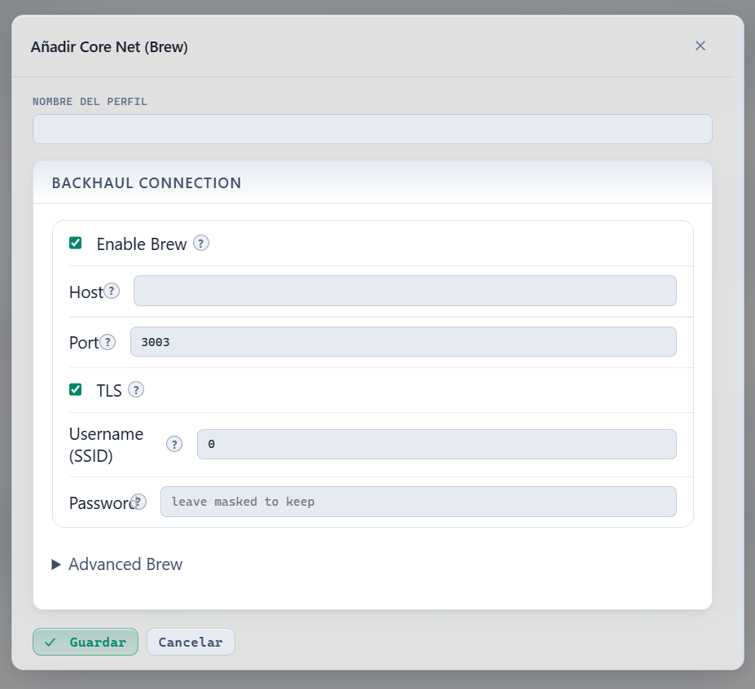

### Lista blanca, dentro del perfil

La lista de ISSI forma parte de la **celda**, no de Brew. Viaja con ese perfil.

- Lista vacía: red abierta, entra cualquier radio.
- Con ISSI: solo esos terminales se registran. El resto se rechaza.

En la ficha, **Guardar** deja la lista en el perfil. No cambia la estación hasta **Aplicar y reiniciar**.

<!-- captura: lista-blanca -->

### Compartir solo perfiles

**Exportar .ptbs** / **Importar .ptbs** mueve el conjunto de celdas y redes Brew, nada más. No toca la configuración que está en marcha y no reinicia. Después de importar, elige la pareja y pulsa **Aplicar y reiniciar** si quieres usarla.

Un `.ptbs` no es una copia de la estación. Para eso está el `.bptbs`, en Sistema.

---

## Ajustes en vivo

**Config → Ajustes en vivo** edita la estación que está corriendo, no un perfil guardado. Sirve para una corrección puntual: una frecuencia, el PPM, la lista blanca de hoy.

**Aplicar y reiniciar** escribe esos formularios en `/etc/ptbs/config.toml` y reinicia. El JSON del perfil **no** se actualiza. Si luego aplicas el perfil antiguo, esa corrección se pierde. Si el cambio debe quedarse, edita el perfil y guárdalo.

**Identidad TETRA → Celdas vecinas aisladas** es la misma lista que en el perfil TMO. Cómo se rellena y qué hace el móvil está en [Celdas vecinas aisladas](#celdas-vecinas-aisladas).

<!-- captura: ajustes-en-vivo -->

La lista blanca de esta sección es la de la config activa. El aviso de la propia pantalla lo dice, para no confundirla con la de un perfil.

### Control remoto (U-STATUS)

También en Config, y es de toda la estación: no se guarda dentro de la celda ni de Brew. Un cambio aquí se aplica al momento.

Autorizas una o varias radios. Esas radios envían un estado U-STATUS al ISSI de control (por defecto 9999). Cada código se asocia a una acción: `ip`, `temp`, `info`, `restart`, `shutdown`, `kick_all`. Así puedes pedir la IP o reiniciar la Pi desde el walkie, sin abrir el panel.

<!-- captura: control-remoto -->

### Temporizadores

En **Red avanzada / temporizadores**, el **?** de cada campo explica el valor.

El que más confunde es **Call timeout**. No es la duración de una pulsación de PTT. Es el tope de una llamada de grupo entera. El **hangtime** (por defecto 5 s) mantiene la misma llamada entre turnos cortos, también en el despacho y en Brew. Con el tope de unos 120 s, una conversación larga puede acabar en «PTT denegado». Súbelo, o pon **0** para quitar el límite.

**Late entry** conviene dejarlo activo: las radios que llegan tarde reciben las llamadas de grupo que ya están abiertas.

**Recuperación al reinicio** está apagada por defecto. Si la activas, tras un reinicio la estación pide a las radios conocidas que se registren otra vez, y el listado de Inicio vuelve a llenarse sin tocar el walkie.

### TOML avanzado

Al final de Config, **Avanzado** muestra el fichero en bruto. Está marcado como solo para quien ya sabe lo que cambia. **Guardar** y **Aplicar y reiniciar** escriben ese texto y reinician. Si el texto no es válido, la estación no lo da por bueno a ciegas: al arrancar puede cargar la reserva y avisarte en rojo.

La referencia comentada de todas las claves está en [`example_config/config.toml`](example_config/config.toml).

---

## Despacho LST

El despacho es una consola de operador en el navegador: voz de grupo, llamada privada y SDS, con la lista de radios y el mapa de posiciones.

### Antes de entrar

1. En **Config**, elige el perfil Brew **Despacho LST** (y la celda que quieras).
2. **Aplicar y reiniciar**.
3. Abre el panel por **HTTPS** y acepta el certificado. Por HTTP el navegador no entrega el micrófono.
4. Entra en **Despacho LST**.

Si el perfil no está aplicado, la página lo dice y ofrece **Ir a Configuración**. Si falta la librería de voz, también lo dice: se instala desde **Sistema → Actualizar**, ya compilada. No se compila en la Pi.

<!-- captura: despacho-no-disponible -->

### Tomar la consola

**Tomar despacho** reserva la consola para este navegador y, a la vez, pide permiso de micrófono y altavoz. Hay que hacerlo con un clic: el navegador no abre el audio solo. Si otra persona ya lo tiene, verás «Despacho en uso por…». **Cerrar despacho** lo suelta.

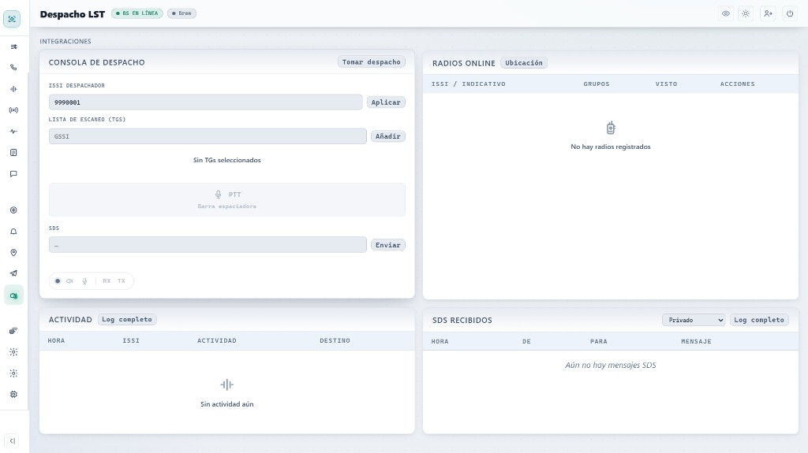

Indica el **ISSI despachador** (el número con el que la consola existe en la celda) y pulsa **Aplicar**. Las radios verán ese ISSI como origen de tu voz y de tus SDS.

### Grupos y PTT

La **lista de escaneo** es tu selección de grupos (GSSI / TG).

1. Escribe un TG y **Añadir**.
2. Marca uno como **TX**. Ese es el grupo por el que hablas. El resto se escucha con menos prioridad.
3. Mantén **PTT**, o la barra espaciadora, para hablar. Suéltalo para callar.

Si otro tiene el suelo, el botón puede ofrecer una interrupción durante unos segundos (un segundo PTT). «Esperando TX…» significa que la estación aún no te ha dado el canal.

El hangtime se aplica igual que en el aire: entre dos pulsaciones cortas sigues en la misma llamada.

### Llamada privada y SDS

En la fila de una radio: **Llamar** abre el cuadro de llamada privada.

- **Simplex:** hablas con PTT, como en un grupo.
- **Dúplex:** al establecerse, el micrófono queda abierto. No hace falta PTT. **Colgar** la cierra.

**Enviar SDS** manda un texto a esa radio o al grupo. Los SDS que llegan se ven en la propia consola y, completos, en **Registro SDS**.

<!-- captura: despacho-llamada-privada -->

### Radios y mapa

**Radios online** es el roster: ISSI, grupos a los que está afiliado y si hay posición. **Ubicación** abre el mapa LIP con las posiciones recientes. **Centrar todos** encuadra los puntos. Si el mapa no carga, queda la tabla.

---

## El resto del monitor

### DGNA

**DGNA** asigna o quita un grupo de conversación a una radio que ya está registrada, sin reprogramarla. Eliges el ISSI, el GSSI y **Asignar** o **Quitar**. También se puede actuar sobre varias radios. La página guarda un registro de lo que se ha pedido.

<!-- captura: dgna -->

### Llamadas, última actividad y logs

**Llamadas** muestra lo que está en curso: grupo, privada simplex, privada dúplex o emergencia, con llamante, destino y duración.

**Última actividad** es el histórico corto de llamadas y SDS.

**Log** es el registro técnico en vivo. Tiene filtro y se puede exportar. Úsalo cuando algo no cuadra (una radio que no registra, un Brew que no conecta).

**Registro SDS** separa texto, estados, posiciones LIP y el resto. Se puede vaciar.

### RF y salud

**RF** enseña el espectro de transmisión, la cascada, la constelación π/4-DQPSK y medidas de calidad, además de la temperatura del SDR y las ganancias reales. Sirve para ver que el equipo transmite y que no se está calentando de más.

**Salud** resume servicio, enlace y congestión.

<!-- captura: rf -->

---

## Red de la Pi

Si la Pi usa NetworkManager, en la barra aparece **Red**. Desde ahí ves Ethernet y Wi-Fi, te conectas a una red, guardas la contraseña u olvidas un SSID.

Si entras al panel por Wi-Fi y cambias de red, puedes quedarte fuera. Ten a mano un cable, u otra forma de entrar, antes de tocar eso. La propia pantalla lo avisa.

El instalador deja el ahorro de energía del Wi-Fi desactivado. Si la asociación se cae, la estación intenta levantar de nuevo un perfil guardado. Aun así, una Pi que solo vive por Wi-Fi puede parecer «muerta» cuando el enlace se va: la celda sigue, y el navegador no.

<!-- captura: red-wifi -->

---

## Sistema

**Sistema** es el mantenimiento: no cambia las frecuencias.

<!-- captura: sistema -->

### Control

- **Reiniciar** para el servicio y lo vuelve a levantar. Corta las llamadas.
- **Suspender** para la radio y deja el panel. El botón pasa a **Iniciar**. Útil para callar la celda sin apagar la Pi.
- **Apagar** apaga el equipo. Para volver, normalmente hay que quitar y poner la alimentación.

Esas tres acciones también están en el menú de alimentación de la barra superior.

### Actualizar (OTA)

1. Elige el canal: **Estable** o **Beta**. Se recuerda en la estación.
2. **Comprobar actualizaciones**. Si hay algo nuevo, o falta el codec de voz, la barra muestra un aviso.
3. **Actualizar** abre tres pasos: canal, novedades y progreso.

La estación descarga el programa y el codec de voz de ese canal, comprueba el SHA-256, los instala y reinicia. No compila nada en la Pi. Deja la ventana abierta hasta que la página vuelva. Perder el contacto unos segundos durante el reinicio es normal. El codec suelto del release es un puente para estaciones 0.5.1; a partir de 0.5.2 también va dentro del paquete.

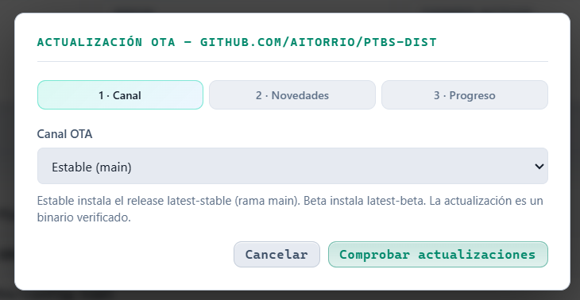

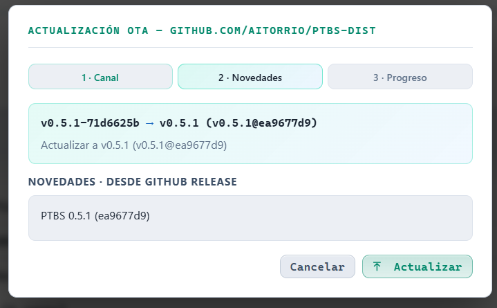

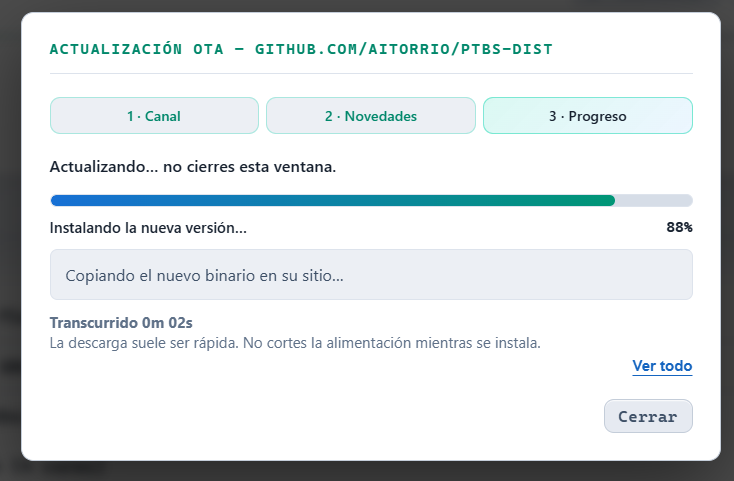

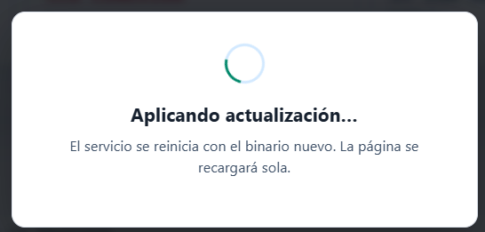

### Acceso al panel

**Acceso al panel** cambia el usuario y la contraseña del navegador. Pide la contraseña actual. Al guardar, hay que entrar de nuevo. Esta cuenta no viaja con los perfiles de celda.

Ahí también están los **puertos del panel**:

- **Estándar:** HTTP 80 redirige a HTTPS 443.
- **Puerto alto:** solo HTTPS 8443, si 80 o 443 están ocupados.

Cambiarlos reinicia la estación. Anota la URL nueva antes de confirmar.

### Copia de la estación

**Exportar .bptbs** descarga un archivo con la estación completa: la config que está en marcha, los perfiles de celda y Brew, la reserva, el estado del asistente y las contraseñas Wi-Fi guardadas.

**Importar .bptbs** sustituye esta estación por esa copia y reinicia. El canal OTA de la Pi de destino se conserva (una Pi en beta no pasa a estable solo por importar). Las redes Wi-Fi se fusionan por nombre.

Trata el `.bptbs` como un secreto: lleva contraseñas.

| Archivo | Qué mueve | ¿Reinicia? |
|---|---|---|
| `.bptbs` | La estación entera | Sí |
| `.ptbs` | Solo perfiles Cell/Brew | No |

<!-- captura: copia-bptbs -->

Para traer una estación anterior: exporta el `.bptbs` allí, instala PTBS en la Pi nueva e impórtalo.

---

## Si algo sale mal

El panel comprueba la configuración antes de escribirla. Si aun así el fichero principal no arranca, el servicio carga `/etc/ptbs/config.toml.fallback`, abre el panel y muestra un aviso rojo. Esa reserva la crea el instalador y **no** se actualiza sola cada vez que guardas.

Desde el aviso puedes volver a un perfil conocido con **Aplicar y reiniciar**, corregir el formulario, usar el editor avanzado o **Restaurar .bak**, y reiniciar. No hace falta reinstalar.

Cuando tengas una configuración en la que confíes, puedes renovar la reserva a mano:

```bash
sudo cp /etc/ptbs/config.toml /etc/ptbs/config.toml.fallback
```

Si el navegador no vuelve tras un reinicio, espera un minuto y recarga. En la Pi, `systemctl status ptbs` dice si el servicio está activo. Cortar la alimentación es el último recurso.

---

## Canales de publicación

| Canal en el panel | Tag del release | Cuándo usarlo |
|---|---|---|
| Estable | `latest-stable` | Uso normal |
| Beta | `latest-beta` | Probar lo último, sabiendo que puede cambiar |

Esos dos son los únicos tags. Cada release incluye el paquete `ptbs_arm64.deb` (programa y codec de voz), el programa `ptbs` y `ptbs.sha256`.

---

## Procedencia

PTBS lo desarrolla **Aitor, EA4HBL**.

Parte de la pila TETRA viene de proyectos anteriores. Sus licencias piden conservar los avisos de copyright. Están en [NOTICE](NOTICE): FlowStation (Razvan Zeces / YO6RZV) y tetra-bluestation (MidnightBlueLabs).

## Licencia

[Apache License 2.0](LICENSE).
